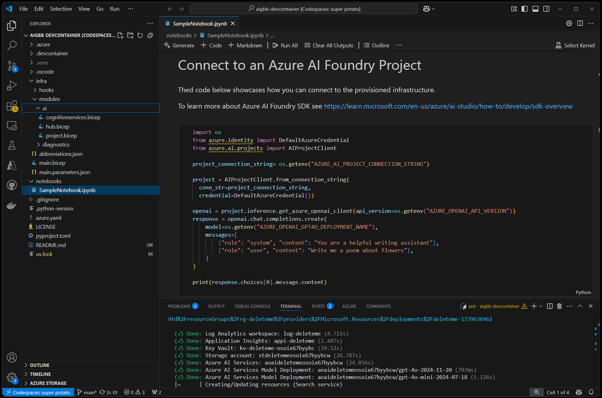

# DevContainer Template for AI work

This is a template for working on Development Containers or GitHub Codespaces with Python and Jupyter Notebooks that I use when working on AI Development projects.

Feedback and bug reports are very welcome! Please open an GitHub issue if you find something that needs fixing or improvement.



## Getting Started

[](https://codespaces.new/dbroeglin/aigbb-devcontainer) [](https://vscode.dev/redirect?url=vscode://ms-vscode-remote.remote-containers/cloneInVolume?url=https://github.com/dbroeglin/aigbb-devcontainer)

> [!WARNING]
> Do NOT `git clone` the application under Windows and then open a DevContainer. 
> This would create issues with file end of lines. For DevContainer click on the button 
> above and let Visual Studio Code download the repository for you. Alternatively you 
> can also `git clone` under Windows Subsystem for Linux (WSL) and ask Visual Studio Code to
> `Re-Open in Container`.

### Provision Azure Resources

Login with AZD:
```bash
azd auth login
``` 

To provision your Azure resources run:
```bash
azd up
``` 

If you want to deploy Azure AI Search run:
```bash
azd env set HAS_AZURE_AI_SEARCH true
azd up
``` 

> [!NOTE]
> Azure AI Search is not provisioned by default due to the increased cost
> and provisioning time.

### Start working

🚀 You can start working straight away by modifying `notebooks/SampleNotebook.ipynb`!

## Contents

  - `notebook/SampleNotebook.ipynb` contains a sample for using [Azure AI Foundry SDK](https://learn.microsoft.com/en-us/azure/ai-studio/how-to/develop/sdk-overview)
  - `pyproject.toml` to manage your Python configuration. Dependencies are automatically installed when the DevContainer is setup (see https://github.com/dbroeglin/aigbb-devcontainer/blob/main/.devcontainer/devcontainer.json#34)
  - `.devcontainer/devcontainer.json` a [Development Container](https://containers.dev/) (works also as a [GitHub Codespace](https://github.com/features/codespaces)) configuration file that includes:
    - Features:
      - [Azure CLI](https://learn.microsoft.com/en-us/cli/azure/what-is-azure-cli): `az`
      - [Azure Developer CLI](https://learn.microsoft.com/en-us/azure/developer/azure-developer-cli/overview): `azd`
      - [GitHub CLI](https://cli.github.com/): `gh`
      - [Node JS](https://nodejs.org/): `node` and `npm`
      - Docker in Docker to run `docker` commands from the DevContainer
    - Extensions:
      - [GitHub Copilot](https://github.com/features/copilot)
      - several Visual Studio Code extensions for Azure
      - a YAML extension
      - [Jupyter Notebooks](https://code.visualstudio.com/docs/datascience/jupyter-notebooks)
      - [UV](https://docs.astral.sh/uv/) UV is my go-to package manager for Python. Alternatively if you want to use `pip` check out the [`feature/pip`](https://github.com/dbroeglin/aigbb-devcontainer/tree/feature/pip) branch.
      - [Starship](https://starship.rs) to manage the terminal prompt.
      - [Many others](https://github.com/dbroeglin/aigbb-devcontainer/blob/main/.devcontainer/devcontainer.json#12)
  - `.gitignore` for Python
  - Open Source MIT `LICENSE`


